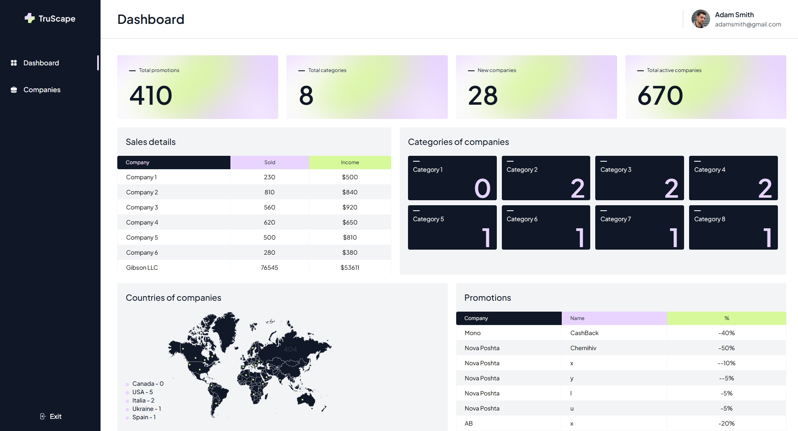

# 🧾 TruScape CRM

A functional CRM system built with **Next.js**, **TypeScript**, **Tailwind CSS**, **Formik**, and **React Query**. It allows users to manage companies and their promotions using a MockAPI-based backend.



## 🚀 Live Demo

- 🧭 [Dashboard](https://crm-7xdf0wca5-valentyn-mostovyis-projects.vercel.app/dashboard)
- 🏢 [Companies](https://crm-7xdf0wca5-valentyn-mostovyis-projects.vercel.app/companies)

## 📦 Tech Stack

- **Next.js 14** (App Router)
- **React 18**
- **TypeScript**
- **Tailwind CSS**
- **Formik** – form state management
- **React Query** – async data fetching
- **MockAPI** – fake REST backend
- **Vercel** – deployment

## ✅ Features

- Create and delete companies
- Assign promotions to companies
- Upload company avatars (not persisted to server)
- Filter by category, country, and status
- Dashboard with summary cards, analytics and map
- Clean responsive UI

## ⚙️ Getting Started

1. Clone the repo:

   ```bash
   git clone https://github.com/Valentyn-M/nextjs-crm.git
   cd nextjs-crm
   ```

2. Install dependencies:

   ```bash
   npm install
   ```

3. Create a `.env.local` file and set your MockAPI project token:

   ```ini
   NEXT_PUBLIC_PROJECT_TOKEN=your-mockapi-project-id
   ```

4. Run the development server:
   ```bash
   npm run dev
   ```

## 📁 Folder Structure

```bash
src/
├── app/
│   ├── dashboard/
│   ├── companies/
│   ├── components/
│   ├── layout.tsx
├── lib/         # API logic (fetchers)
├── styles/      # Tailwind config
```

## 👨‍💻 Author

**Valentyn Mostovyi**  
[GitHub Profile](https://github.com/Valentyn-M)

---

> This project was built as part of a hands-on Next.js course, combining frontend logic, backend integration via MockAPI, and full deployment on Vercel.
